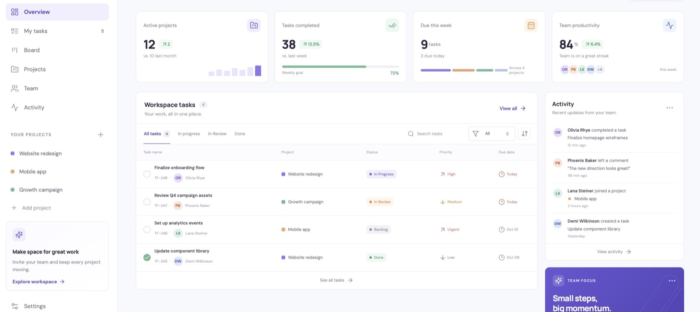
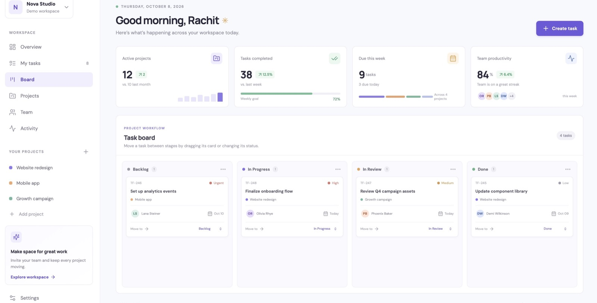
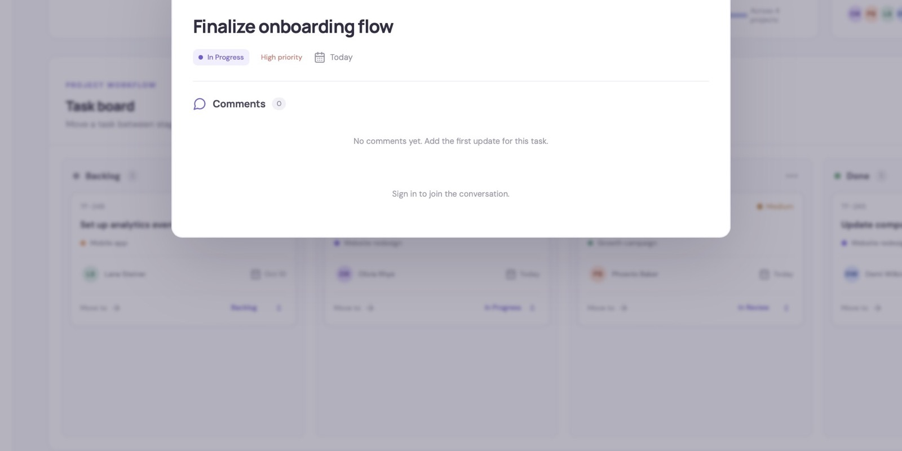
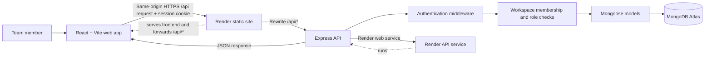
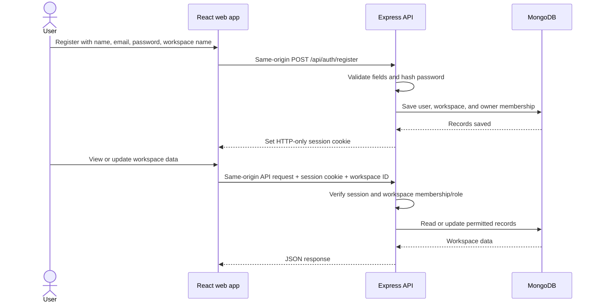
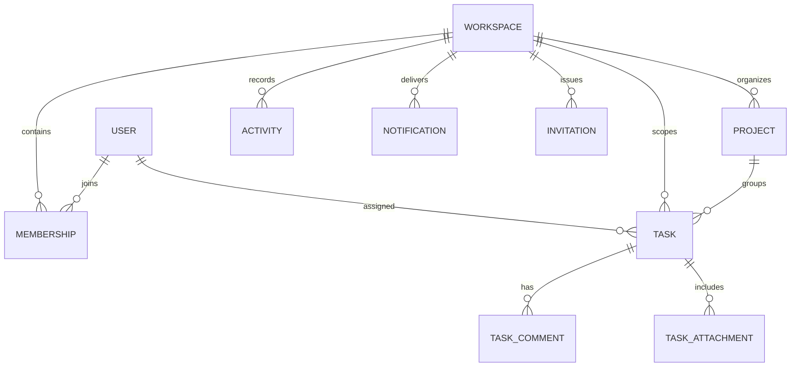

# TaskFlow Pro

**A team workspace for planning projects, assigning work, and tracking progress.**

**Created by [Rachit Tripathi](https://github.com/rachit1807)** · [Portfolio](https://rachit1807.github.io/rachit-tripathi-portfolio/)

[Open the live app](https://taskflow-pro-web.onrender.com/) · [View the GitHub repository](https://github.com/rachit1807/TaskFlow-Pro) · [Check API health](https://taskflow-pro-api-3nwo.onrender.com/api/health)

TaskFlow Pro is a MERN project-management application. Teams organize work in workspaces, divide it into projects, and track individual tasks from backlog through completion. The app includes role-aware access, a Kanban board, comments, file attachments, team invitations, activity history, and notifications.

> **Try it:** Open the live app, choose **Sign in**, then **Create an account**. Registration asks for your name, email, password, and the name of your first workspace. The dashboard also includes sample data so you can preview the interface before signing in; sample data is not saved to your account.

## Screenshots

These screenshots show the public sample workspace in the live app. Sample data is for preview; changes are saved only after signing in.

### Workspace overview



### Kanban board



### Task details and comments



## Contents

- [Screenshots](#screenshots)
- [What you can do](#what-you-can-do)
- [How the app fits together](#how-the-app-fits-together)
- [How a request works](#how-a-request-works)
- [Workspace roles](#workspace-roles)
- [Data and security](#data-and-security)
- [Run it locally](#run-it-locally)
- [Environment variables](#environment-variables)
- [Deploy it](#deploy-it)
- [Repository layout](#repository-layout)
- [Current scope](#current-scope)

## What you can do

| Area | Capabilities |
| --- | --- |
| Accounts | Register, sign in, sign out, check the current session, and update your profile name |
| Workspaces | Create a workspace during registration, switch between memberships, and manage the team |
| Roles | Owner, admin, manager, and employee roles, with server-side permission checks |
| Invitations | Invite a teammate by email and role with a single-use, expiring invite link |
| Projects | Create projects, view task counts, and archive or restore projects |
| Tasks | Create and edit tasks with descriptions, assignees, status, priority, due dates, labels, and project association |
| Finding work | Search tasks, filter by priority or status, and use paginated task results in the API |
| Board | Move work through the Kanban workflow and open tasks for more detail |
| Collaboration | Add comments, review workspace activity, and receive in-app notifications for assignments and comments |
| Attachments | Upload and download private task files up to 5 MB, subject to workspace access checks |
| Profile | Update the display name shown to teammates |

Supported attachment types include PDF, common image formats, text/CSV, ZIP, and Office documents. Uploads are stored in MongoDB in this version.

## How the app fits together



The browser handles the interface and sends same-origin `/api` requests through the Render static site's rewrite to the separately deployed API. The API validates inputs, authenticates the user, checks access to the selected workspace, and reads or writes records in MongoDB. Keeping API requests on the web app's origin lets Safari and other browsers use the HTTP-only session cookie reliably on Render's shared hosting domains.

### Sign-in and workspace request flow



## How a request works

1. The frontend sends a same-origin `/api` request with the browser's HTTP-only session cookie. Workspace-scoped requests include the selected workspace ID in the `X-Workspace-Id` header. In production, Render rewrites `/api/*` to the API service; local Vite development proxies `/api` to port 4000.
2. Authentication middleware verifies the signed session and loads the user.
3. Workspace middleware finds that user's membership in the requested workspace. Role-protected routes check whether the role permits the operation.
4. The route validates the request, performs the operation through Mongoose, and returns JSON.
5. The UI updates to show the returned data. When a user is signed out, the interface uses sample preview data instead.

## Workspace roles

Permissions are enforced by the API, not just by hiding buttons in the interface.

| Role | Typical access |
| --- | --- |
| Owner | Full workspace control, including admin access management |
| Admin | Manage members and workspace operations; cannot change or remove the owner |
| Manager | Coordinate projects and tasks; can invite employees |
| Employee | Work on assigned team tasks and collaborate within the workspace |

The exact permission requirements are applied by the individual API routes. For example, only owners and admins can change member roles, while managers can invite employees but cannot grant admin access.

## Data and security

- Passwords are hashed before storage; plaintext passwords are not saved.
- Sessions use signed JSON Web Tokens in HTTP-only cookies, so frontend JavaScript cannot read the session token.
- Authentication endpoints have rate limits, request payloads are validated, and security headers are enabled.
- Workspace IDs are checked against the signed-in user's memberships before workspace records are accessed.
- Invitations use random tokens; only a hash is stored, and invitations expire after seven days.
- Task attachments require workspace access and are limited by size and allowed file types.
- Production secrets are configured in Render environment settings and are not committed to this repository.

### Main data records



## Run it locally

### Requirements

- Node.js 20.19+ or 22.12+
- npm
- MongoDB Community Server or a MongoDB Atlas database

### Setup

1. Clone the repository and open the project folder.
2. Copy `.env.example` to `.env` in the repository root.
3. Set `MONGODB_URI` to your own local or Atlas database connection string.
4. Replace `JWT_SECRET` with a unique random secret at least 32 characters long.
5. Install dependencies from the repository root:

   ```bash
   npm install
   ```

6. Start the local web app and API:

   ```bash
   npm run dev
   ```

7. Open [http://localhost:5173](http://localhost:5173). The API listens at [http://localhost:4000](http://localhost:4000); its health endpoint is [http://localhost:4000/api/health](http://localhost:4000/api/health).

The sample dashboard can be viewed without a database connection. Registration, sign-in, and saved workspace features need a reachable MongoDB database and a valid `JWT_SECRET`.

## Environment variables

| Variable | Purpose | Local example |
| --- | --- | --- |
| `PORT` | API port | `4000` |
| `CLIENT_ORIGIN` | Allowed frontend origin for direct API requests | `http://localhost:5173` |
| `MONGODB_URI` | MongoDB connection string | `mongodb://127.0.0.1:27017/taskflow_pro` |
| `JWT_SECRET` | Secret used to sign session tokens; use a unique value of 32+ characters | Replace the example value |
| `NODE_ENV` | Runtime environment | `development` |

Keep `.env` private. Do not put database credentials or production secrets in source files, README examples, screenshots, or commits.

## Deploy it

The repository includes a [`render.yaml`](render.yaml) Blueprint for the React static site and Express API. The web app sends same-origin API requests through a Render rewrite, so browser session cookies remain first-party. The running deployment is:

- **Web app:** [taskflow-pro-web.onrender.com](https://taskflow-pro-web.onrender.com/)
- **API health:** [taskflow-pro-api-3nwo.onrender.com/api/health](https://taskflow-pro-api-3nwo.onrender.com/api/health)

To create your own deployment:

1. Connect the repository to Render as a Blueprint.
2. Configure `MONGODB_URI` in the API service using a database user with only the required permissions.
3. Keep `JWT_SECRET` private; the Blueprint can generate it for the API service.
4. Configure the MongoDB network access rules for the hosting provider.
5. Wait for both services to deploy, then open `/api/health` and confirm the database reports `connected`.

The free API service may sleep after inactivity, so the first request after a quiet period can take longer. The published deployment uses MongoDB Atlas. The shared Render network ranges are specific to that deployment; review your own hosting provider's current network guidance before configuring database access.

## Repository layout

```text
TaskFlow-Pro/
├── apps/
│   ├── api/                 # Express routes, middleware, and Mongoose models
│   └── web/                 # React interface, styles, and Vite configuration
├── packages/
│   └── shared/              # Shared task statuses and priorities
├── scripts/                 # Local development process helper
├── .env.example             # Safe local configuration template
├── render.yaml              # Render Blueprint for web and API services
└── README.md
```

## Current scope

This version provides the working features listed above. Email delivery for invitation links, external file storage, real-time push updates, and production observability are not configured. Invitation links can be created in the app, but sending them requires an email provider integration. These capabilities need additional provider setup before the app is ready for a production company's internal operations.

## License

No open-source license is currently included. Contact the repository owner before reusing this project beyond personal evaluation.

---

<p align="center">
  Designed and built with care by <a href="https://github.com/rachit1807">Rachit Tripathi</a>.
</p>
